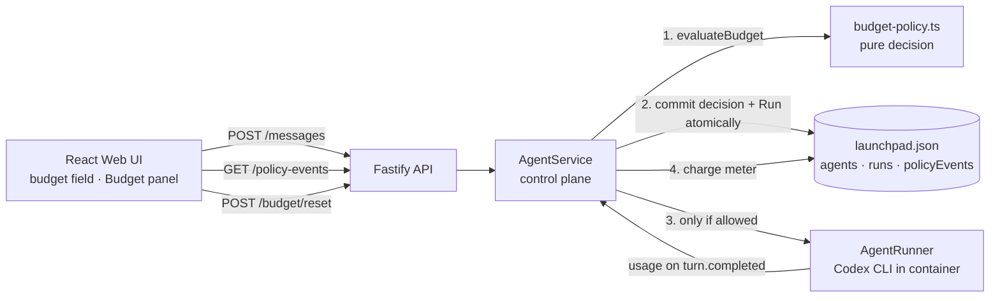

# Agent Launchpad — Token Budget Middleware

TikTok TechJam 2026 · Track 1 (Agent Launchpad) · solo submission by [LyraYu](https://github.com/LyraYu)

This repository is the official Track 1 Starter Kit plus **one middleware capability**:
a per-Agent token budget, enforced in the control plane before a Run is admitted,
with a policy event ledger that records every allow / charge / deny / reset decision.

The Starter Kit itself (Agent CRUD, Playground, Codex CLI Runtime, containers) is
unchanged. Its original README is preserved at [docs/STARTER_KIT.md](docs/STARTER_KIT.md).

---

## 1. Problem

The Starter Kit already reports token usage for every Run (`RunUsage.inputTokens`,
`outputTokens`), but the platform does nothing with it. Any Agent can consume an
unbounded number of model tokens across Runs. There is no per-Agent limit, no
record of *why* a Run was admitted, and no way for an operator to stop a runaway
Agent short of deleting it.

This is the "runaway execution or cost" threat from the challenge brief. A single
ordinary Playground task on this platform costs on the order of tens of thousands
of tokens (a Node hello-world-with-tests task measured ~94k tokens with
Seed-2.0-Code), so cost control is an Agent-specific problem, not a generic one.

## 2. What the middleware does

| Capability | Where it executes | Evidence produced |
|---|---|---|
| Admission check: deny a Run when `tokensUsed >= tokenBudget` | `AgentService.sendMessage`, inside the same store transaction that reserves the Agent | `budget.allowed` or `budget.denied` event; HTTP `429` on denial |
| Metering: add the Runtime-reported usage to the Agent meter after a completed Run | `AgentService.executeRun` completion path | `budget.charged` event |
| Gap recording: note when a failed/cancelled Run reported no usage | `AgentService.executeRun` failure path | `budget.unmetered` event |
| Recovery: operator clears the meter and optionally sets a new limit | `POST /api/agents/:id/budget/reset` | `budget.reset` event |
| Configuration | `tokenBudget` on create / update; blank = unlimited | stored on the `Agent` record |

The decision logic lives in one pure module, [`apps/server/src/budget-policy.ts`](apps/server/src/budget-policy.ts),
so it can be unit-tested without a store, a Runtime, or HTTP.

## 3. Architecture and trust boundary



A one-page version is in [docs/architecture.svg](docs/architecture.svg).

**Who owns the decision.** The control plane (`AgentService`). The UI only
displays state; a client that bypasses the UI still hits the same check.

**What crosses the boundary.** Inbound: the Agent's `tokenBudget` and
`tokensUsed`. Outbound to the Runtime: nothing new — the Runtime is only invoked
if the decision was *allow*. Inbound from the Runtime: `RunUsage`, which is the
sole source of truth for charging.

**Why admission is atomic.** The budget check runs inside the same
`JsonStore.mutate` transaction that flips the Agent to `busy`. Because the
platform admits at most one Run per Agent at a time, the check-then-charge
sequence cannot double-spend: no second Run can pass the check until the first
has been charged.

**Why a denial is committed as data.** A first implementation threw the `429`
from inside the transaction, which rolled back the ledger entry together with
the rejected Run — the denial left no trace. The current code returns the
decision from the transaction, persists the `budget.denied` event, and throws
afterwards. The evidence survives the refusal.

**What happens on failure.** If the Runtime fails or is cancelled it reports no
usage. The meter is left unchanged and a `budget.unmetered` event is written so
the ledger has an entry for every Run, including the ones it could not bill.

## 4. API

| Method | Path | Notes |
|---|---|---|
| `POST` | `/api/agents` | body may include `tokenBudget: number \| null` |
| `PATCH` | `/api/agents/:id` | same field |
| `POST` | `/api/agents/:id/messages` | returns `429` with the denial reason when the budget is exhausted; no Run or message is created |
| `GET` | `/api/agents/:id/policy-events` | ledger, newest first |
| `POST` | `/api/agents/:id/budget/reset` | body `{ tokenBudget?: number \| null }`; `409` while a Run is active |

`Agent` records gain two fields: `tokenBudget` (`null` = unlimited) and
`tokensUsed`. Existing `launchpad.json` files are upgraded in place with safe
defaults on startup; the database version stays `1`.

## 5. Run it

Requirements are unchanged from the Starter Kit: Node 22+, npm 10+, and Docker /
Colima / Podman. You also need a ModelArk API key and an endpoint ID that
supports the Responses API.

```bash
git clone https://github.com/LyraYu/techjam-agent-launchpad.git
cd techjam-agent-launchpad
ARK_API_KEY=your-ark-api-key \
ARK_MODEL=ep-your-endpoint-id \
ARK_BASE_URL=https://ark.ap-southeast.bytepluses.com/api/v3 \
npm run poc
```

Open http://localhost:3000. `ARK_BASE_URL` is required for BytePlus (international)
accounts; the Starter Kit default points at Volcengine China.

Verification:

```bash
npm run check   # typecheck + vitest + production build
```

## 6. Tests

New tests (9) alongside the Starter Kit's existing 13:

- `budget-policy.test.ts` — pure decisions: unlimited, remaining, exhausted, usage summing.
- `agent-budget.test.ts`
  - full scenario through `AgentService`: allow → charge → allow → charge → **deny (429)** → assert no Run, no message, no Runtime call leaked → reset → allow again; asserts the exact ledger sequence.
  - an Agent without a budget is metered but never denied.
  - reset is refused (`409`) while a Run is active.
  - a failed Run leaves the meter unchanged and writes `budget.unmetered`.
  - a pre-middleware `launchpad.json` is upgraded with defaults.
  - HTTP boundary: `201` create with budget, `202` admit, `429` deny, ledger readable, reset returns `tokensUsed: 0`, negative budget rejected with `400`.

## 7. Demo script (3 minutes)

1. Create an Agent with **Token budget = 150000**.
2. Send a task, e.g. *"Create a small Node.js script that prints a 1–9 multiplication table, add a test with node:test, and run it."* Show the Run completing and the Budget panel updating (`budget.allowed`, then `budget.charged` with the real token count).
3. Send a second task. It is admitted (tokens remain) and pushes the meter past the limit.
4. Send a third task. The control plane returns `429`; the panel shows a red `budget.denied`. Point out that the server log shows **no container start** — the Runtime was never invoked.
5. Click **Reset budget**. `budget.reset` appears, meter returns to 0.
6. Send once more: admitted and completed. The Agent remains inspectable and controllable throughout.

## 8. Limitations (and why)

1. **Enforcement is per-Run, not intra-Run.** A Run that starts with 1 token
   remaining can still consume 90k tokens. Codex CLI reports usage only on the
   `turn.completed` event, so there is no mid-turn signal to act on. A hard
   intra-Run cap would need a metering proxy in front of the Ark endpoint or
   Runner-level cancellation on a wall-clock/step budget; that is the natural next
   step and belongs at the Runtime boundary, not the control plane.
2. **Failed or cancelled Runs are not charged.** The Runtime returns no usage on
   error. A prompt that reliably crashes the Run could consume tokens without ever
   being billed. The `budget.unmetered` event makes this visible rather than
   silent, but does not close the gap.
3. **Reset has no principal.** The platform has no user identity, so "operator"
   means anyone with API access. Pairing this middleware with an identity layer
   would make reset an attributed, approvable action.
4. **Cached input tokens are not billed.** `cachedInputTokens` is reported but
   excluded from the meter, since cache hits are priced differently. This is a
   policy choice, documented here.
5. **The ledger grows without bound** in the JSON store, and the UI shows only the
   latest 8 events. Retention and pagination were out of scope.

## 9. Contributions

Solo submission. All middleware code, tests, and documentation by LyraYu, with an
AI coding assistant used for drafting and review. No secrets are committed;
`.env`, `.data/`, `workspaces/`, and `codex-home/` are git-ignored.
